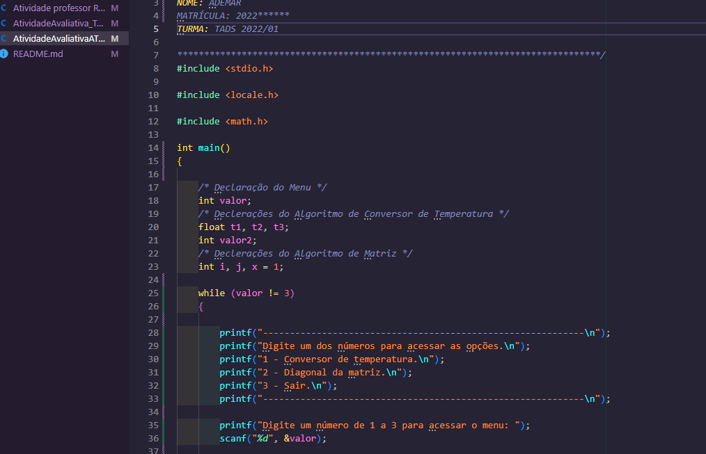

# Projeto em C: Algoritmos de Introdução a Lógica de Programação em Linguagem C

Este projeto foi desenvolvido como parte do curso de Tecnologia em Análise e Desenvolvimento de Sistemas no Instituto Federal de Educação, Ciência e Tecnologia do Amazonas. O objetivo do projeto é explorar diferentes algoritmos implementados em linguagem C.

## Imagem do Projeto

## Algoritmo 1: Conversor de Temperatura

Este algoritmo permite converter temperaturas entre diferentes escalas: Celsius, Kelvin e Fahrenheit. O usuário pode fornecer uma temperatura em Celsius e escolher a escala de destino. O programa realizará a conversão e exibirá o resultado.

## Algoritmo 2: Matriz Diagonal

Neste algoritmo, uma matriz de 10x10 é exibida, onde os elementos da diagonal principal são marcados com um número sequencial. Os demais elementos são espaços em branco. O resultado é uma matriz de exibição na saída do console.

## Algoritmo 3: Raízes de uma Equação do Segundo Grau

Este algoritmo calcula as raízes de uma equação do segundo grau. O usuário deve fornecer os coeficientes da equação (a, b e c) e o programa calculará o valor do delta e as raízes, exibindo o resultado na saída do console.

## Algoritmo 4: Divisão Utilizando Subtração Sucessiva

Neste algoritmo, é realizada uma divisão entre dois números reais utilizando o método de subtração sucessiva. O usuário fornece os números e o programa calcula o resultado da divisão, exibindo-o na saída do console.

Cada algoritmo é implementado em uma função separada dentro do programa principal. O usuário pode selecionar qual algoritmo deseja executar através de um menu de opções. O programa continua em execução até que o usuário escolha a opção de sair.

Este projeto foi desenvolvido por Ademar Castro, matrícula 2022....44, na turma TADS 2022/01.

## Instruções de Compilação e Execução

1. Certifique-se de ter um compilador C instalado em seu sistema.
2. Abra o terminal e navegue até o diretório onde os arquivos do projeto estão localizados.
3. Compile o código-fonte digitando o seguinte comando: `gcc projeto.c -o projeto`
4. Execute o programa digitando o seguinte comando: `./projeto`
5. Siga as instruções exibidas na tela para interagir com os algoritmos implementados.

Certifique-se de ter as bibliotecas `stdio.h`, `locale.h` e `math.h` instaladas em seu ambiente de desenvolvimento.

**Observação:** Este projeto foi desenvolvido como parte de um curso acadêmico e tem como objetivo educacional.
